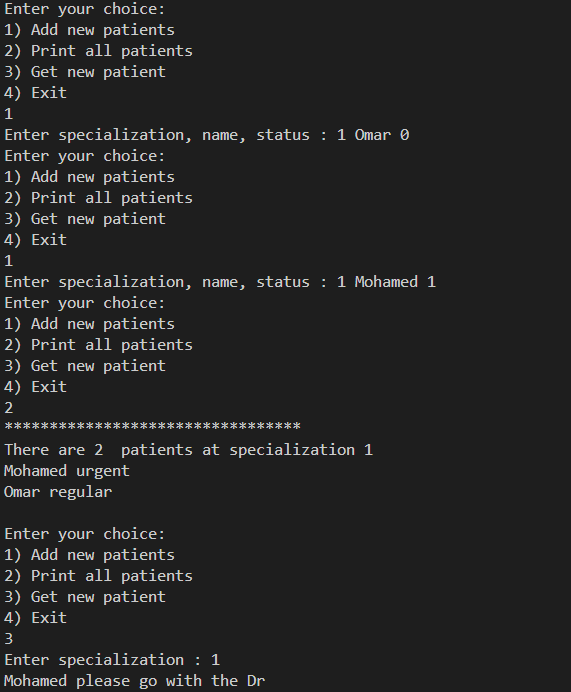

# Hospital System

## Overview
The **Hospital System** is a simple patient management system that organizes patients into 20 different medical specializations. Each specialization has a queue with a maximum of 5 patients. The system prioritizes urgent patients while maintaining a queue for regular ones.

## Features
- Supports **20 different specializations** (e.g., Surgery, Neurology, Pediatrics, etc.).
- Each specialization has a **maximum capacity of 5 patients**.
- **Patient addition based on urgency:**
  - **Urgent patients** (status = 1) are added at the front of the queue.
  - **Regular patients** (status = 0) are added at the end of the queue.
- If a specialization queue is full, new patients are **not accepted**.

## How It Works
1. **Adding a Patient:**
   - The user enters the specialization number [1-20].
   - The system prompts for the patient’s name and status (0 for regular, 1 for urgent).
   - If the queue is not full, the patient is added accordingly.
   - If the queue is full, the system displays a message denying entry.

2. **Displaying Patients:**
   - The system shows the list of patients for each specialization in order of priority.

3. **Removing a Patient:**
   - The first patient in the queue (urgent or regular) is removed when attended.

## Requirements
- C++ (or any preferred programming language supporting queue-based data structures)

## Usage
1. Compile the code using a C++ compiler.
2. Run the program.
3. Follow the prompts to add, view, or remove patients.

## Future Improvements
- Implement a graphical interface.
- Extend the system to support more complex patient management features.
- Store patient data persistently using a database.

## Author
Omar Saad

